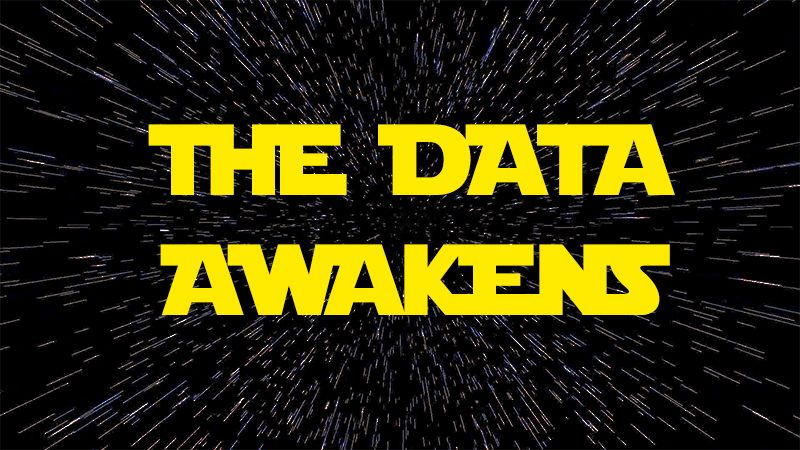
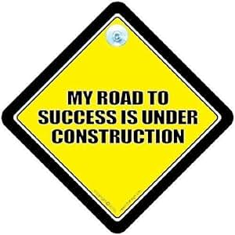

# Data Science & Machine Learning Projects

<!-- 
This is the place where
 -->

  

<!-- 

  <!-- 
<!-- 
 -->

## About Me

I am a data driven visual story-teller. Let me narrate a story...

Growing up, my first encounter with a computer was a momentous occasion. Housed in an air-conditioned room, it was a massive machine that demanded respect. The teacher introduced us to the wonders of computing by unveiling a mysterious square object – the floppy disk. We'd gaze in amazement as it was inserted, eagerly awaiting the computer's awakening through the arcane process of booting. The experience of entering that exclusive space, shoes left outside, was a ritual that marked the beginning of my journey into the realm of technology.

Over time, I witnessed the remarkable evolution of computing. From desktop PCs that took minutes to boot without the reliance on floppy disks, to sleek machines with flat screens and separate CPU units, and eventually to the portability of laptops with substantial memory. The storage media evolved too – from the once-miraculous floppy disks and CDs to the convenience of USBs and the compact efficiency of SD cards. As technology progressed, the demand for storage space surged while the physical footprint of storage solutions dramatically diminished. This transition, accompanied by the explosion of data from mere megabytes to the era of gigabytes and terabytes, marked an extraordinary journey through the ever-evolving landscape of computing and storage.

During my tenure at AGCO, the observation of substantial data generation intrigued me as it often disappeared into storage spaces and eventually into the cloud. This curiosity led me from managing data in Excel sheets to exploring its potential through Tableau, progressing further into Python, and eventually delving into the realms of Machine Learning, AI, and now Large Language Models (LLMs).

Delving into diverse datasets is a source of genuine enjoyment for me, and I am driven by a passion not only for embracing novel technologies but also for pushing the boundaries of my understanding and imparting that knowledge to others. My proficiency spans various facets of data science, including hands-on experience in visualizing data, conducting exploratory and statistical analyses, modeling, and designing end-to-end architectures for comprehensive modeling solutions.
